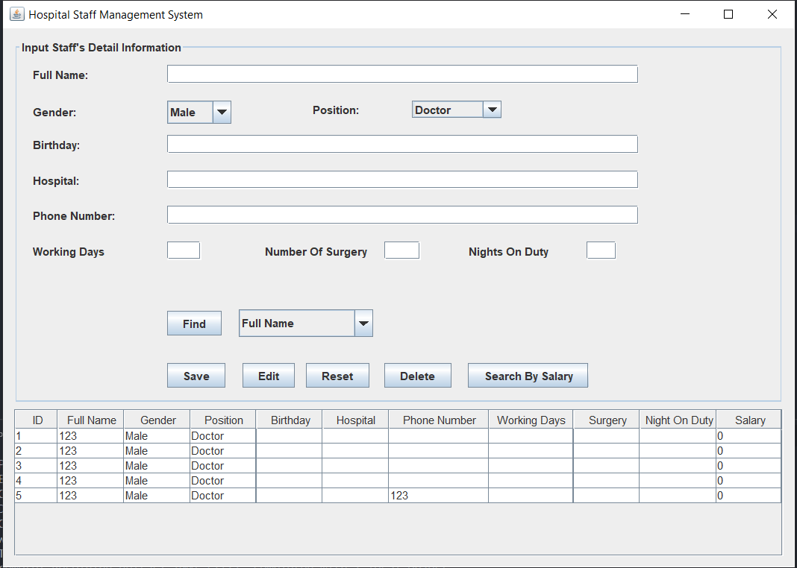

# Shipping System

### Technologies
- **JAVA SWING**: xây dựng giao diện, tham khảo: [docs](https://www.javatpoint.com/java-swing)
- **MYSQL**: cung cấp cơ chế lưu trữ và quản lý cơ sở dữ liệu quan hệ(SQL) một cách thuận tiện và dễ dàng, tham khảo: [docs](w3schools.com/sql/)
---
### Install
    IDE: Netbean,
    CSDL: MySql

---
### Runs
* Create name's database in MySql : mydatabase
* if  user = root, password = 123456 in MySql : (ShippingModify.java)
*       connection = DriverManager.getConnection("jdbc:mysql://localhost:3306/mydatabase", "root", "123456");
* else edit respectively
*     connection = DriverManager.getConnection("jdbc:mysql://localhost:3306/mydatabase", "....", "......"); 
* Run project: `run App.java`

App will run

---
### Note
- You can see my project, it's [here](https://github.com/nguyenhv01012000/IT3100Q_121723_Project_Group01_PN04)
